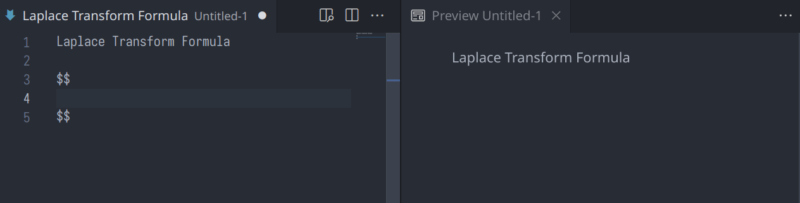

# LaTeX 代码片段

LaTeX 大多具有固定的形式，使用代码片段能够简化编辑流程、提高编写速度。本文件夹内的 `latex.hsnips` 文件为 VS Code 用户提供了基本的代码片段，供参考使用。Vim 用户可以在我的 [nvim 仓库](https://github.com/iChunyu/nvim/tree/main/UltiSnips/tex) 找到更多代码片段。

    

## 插件安装与配置

1. 打开 VS Code 插件，搜索 [`HyperSnips`](https://marketplace.visualstudio.com/items?itemName=draivin.hsnips) 并安装；
2. 在 VS Code 主界面按组合键 `<Ctrl><Shift>p` 打开命令面板，输入 `hyper` 进行搜索，点击 __HyperSnips: Open Snippets Directory__；
3. 将本目录下的 `latex.hsnips` 文件复制到 HyperSnips 文件夹内；
4. 在 VS Code 主界面按组合键 `<Ctrl><Shift>p` 打开命令面板，输入 `hyper` 进行搜索，点击 __HyperSnips: Reload Snippets__ 即可。

提示：`latex.hsnips` 中的数学功能同样适用于 Markdown 文件，为此，需要将该文件复制并重命名为 `markdown.hsnips`，并重复上述第四步。用于 Markdown 时适当删除文件中 LaTeX 特有的环境。

## 使用方法

> `latex.hsnips` 的大部分代码片段设置了自动展开，避免了通常情况下使用 `<Tab>` 展开的繁琐。极少数情况下的拼写会触发代码片段，此时可以使用 `<Ctrl>z` 撤销。笔者认为：虽然存在误触的情况，但概率较小，相比于手动触发还是能够节省操作时间，故未作修改。

### 关键字触发

在输入过程中键入关键字，可触发相应的代码片段，这类代码片段包括。根据代码片段所在的位置，通常可以设置一定的约束条件减少误触发的概率，常用条件包括：

- 行首触发：仅当关键字出现在行首时可以触发代码片段；
- 边界触发：当关键字单独出现，即前后为空格或边界时可以触发代码片段；
- 词内触发：任意位置只要出现关键字就可以触发代码片段。

某些代码片段具有多个占位符（例如插图环境），编辑时可以使用 `<Tab>` 向后跳转。

| 关键字     | 功能                   | 触发条件 |
| ---        | ---                    | ---      |
| `env`      | 新建 LaTeX 环境        | 行首触发 |
| `beg`      | 新建 LaTeX 环境        | 行首触发 |
| `fig`      | 新建插图环境           | 行首触发 |
| `tabu`     | 新建普通表格           | 行首触发 |
| `tabx`     | 新建定宽表格           | 行首触发 |
| `tabl`     | 插入三线表的横线       | 行首触发 |
| `equ`      | 单行公式环境           | 行首触发 |
| `gat`      | 居中对齐的多行公式环境 | 行首触发 |
| `ali`      | 手动对齐的多行公式环境 | 行首触发 |
| `gad`      | 居中对齐公式的子环境   | 边界触发 |
| `ald`      | 手动对齐公式的子环境   | 边界触发 |
| `pmat`     | 圆括号包围的矩阵环境   | 边界触发 |
| `bmat`     | 方括号包围的矩阵环境   | 边界触发 |
| `Bmat`     | 花括号包围的矩阵环境   | 边界触发 |
| `vmat`     | 单竖线包围的矩阵环境   | 边界触发 |
| `Vmat`     | 双竖线包围的矩阵环境   | 边界触发 |
| `ff`       | 插入数学分式           | 边界触发 |
| `lr()`     | 自动大小的圆括号       | 边界触发 |
| `lr[]`     | 自动大小的方括号       | 边界触发 |
| `lr{}`     | 自动大小的花括号       | 边界触发 |
| `lr<`      | 自动大小的尖括号       | 边界触发 |
| `ab\|`     | 自动大小的绝对值符号   | 边界触发 |
| `no\|`     | 自动大小的范数符号     | 边界触发 |
| `b()`      | 手动大圆括号           | 边界触发 |
| `b2()`     | 手动更大的圆括号       | 边界触发 |
| `b3()`     | 手动超级大的圆括号     | 边界触发 |
| `b4()`     | 手动究极大的圆括号     | 边界触发 |

### 后缀式触发

使用正则表达式结合词内触发可以实现更常用的~~后入式~~后缀式触发，这在对数学符号进行修饰时非常好用。例如本文开头动画示例，微分算子通常需要直立体，应当输入 `\mathrm{d}`。使用本文所述的代码片段，只需要先输入 `d`，然后使用 `rm` 触发正体命令即可自动将其变更为目标格式。类似的功能有（用 `X` 表示后缀前面的内容，不能出现空格）：

| 后缀  | 功能           | 说明                   |
| ---   | ---            | ---                    |
| `rm`  | `\mathrm{X}`   | 将变量变为直立体       |
| `bf`  | `\mathbf{X}`   | 将变量变为粗体         |
| `fk`  | `\mathfrak{X}` | 将变量变为哥特体       |
| `bm`  | `\bm{X}`       | 使用 `bm` 宏包加粗变量 |
| `ii`  | `X^{-1}`       | 求逆                   |
| `sr`  | `\sqrt{X}`     | 开方                   |
| `vec` | `\vec{X}`      | 箭头（矢量符号）       |
| `dot` | `\dot{X}`      | 一个点（一阶导数）     |
| `ddo` | `\ddot{X}`     | 两个点（二阶导数）     |
| `hat` | `\hat{X}`      | 尖帽子（估计值）       |
| `bar` | `\bar{X}`      | 横线（平均值）         |
| `bre` | `\breve{X}`    | 圆帽子（测量值）       |
| `til` | `\tilde{X}`    | 波浪线（误差）         |

使用后缀触发可以实现更加便利的功能：

- __分式自动处理__

1500 页数学笔记的小哥在他的 [博客](https://castel.dev/post/lecture-notes-1/) 中给出了自动处理分式的代码片段：在数学模式下，当输入除法 `/` 时，会自动将前面的字符作为 `\frac` 的分子，并跳转到分母位置。当分子不止一个变量时，可以使用圆括号括起后再输入 `/`，此时分子会自动取消最外围用于定界的圆括号。

- __角标自动处理__

数学通常会与角标打交道，为此，我在数学模式下定义了用于处理角标的 `;`，基本用法为：`任意字符;下标;上标;` 。代码片段在感受第三个封号后会自动处理角标，并且会根据字符长度选择性地添加 `{}`。下标或上标可以置空，但不允许出现空格。角标中处理特殊符号时可以使用空的花括号分隔命令，例如 `\omega{}t` 。
